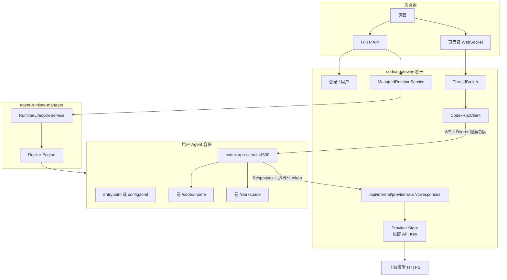
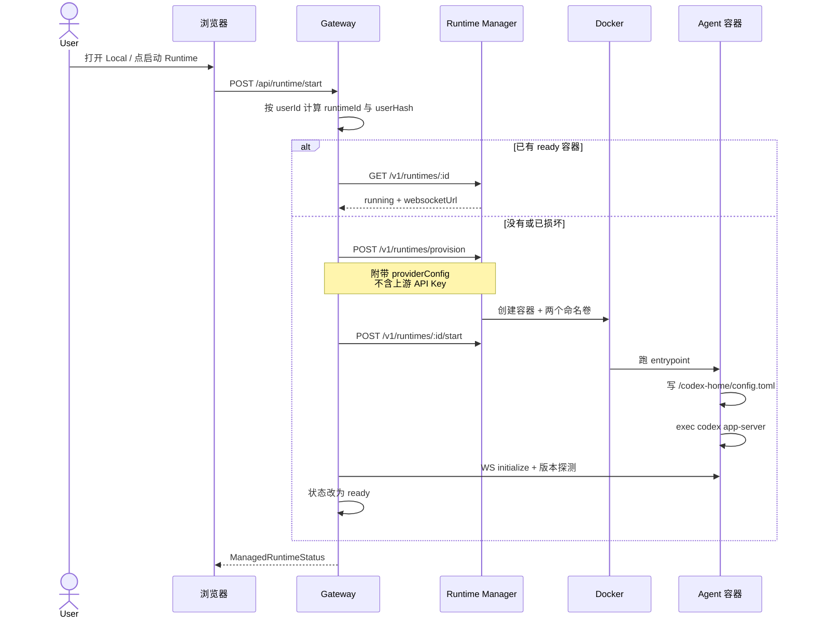
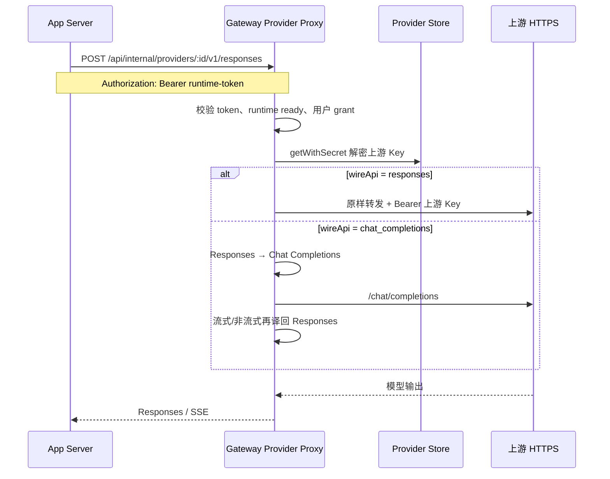
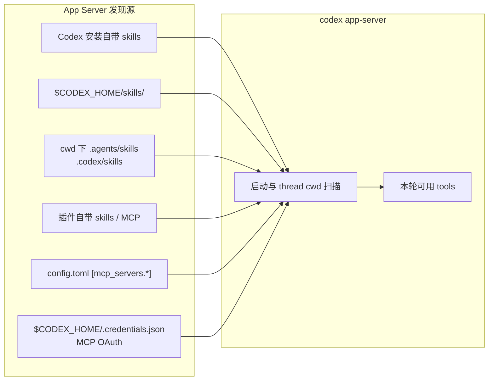
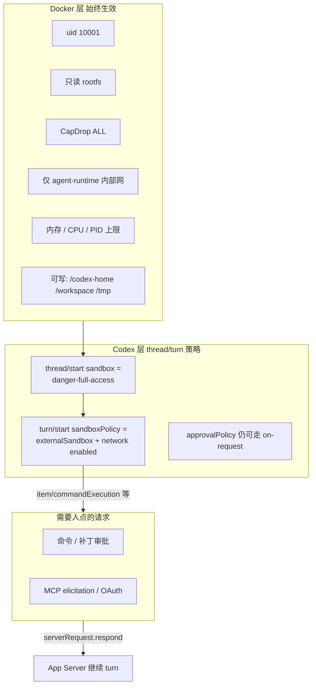
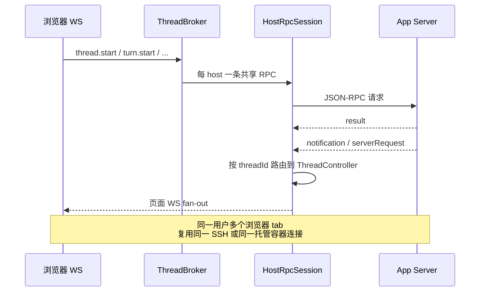
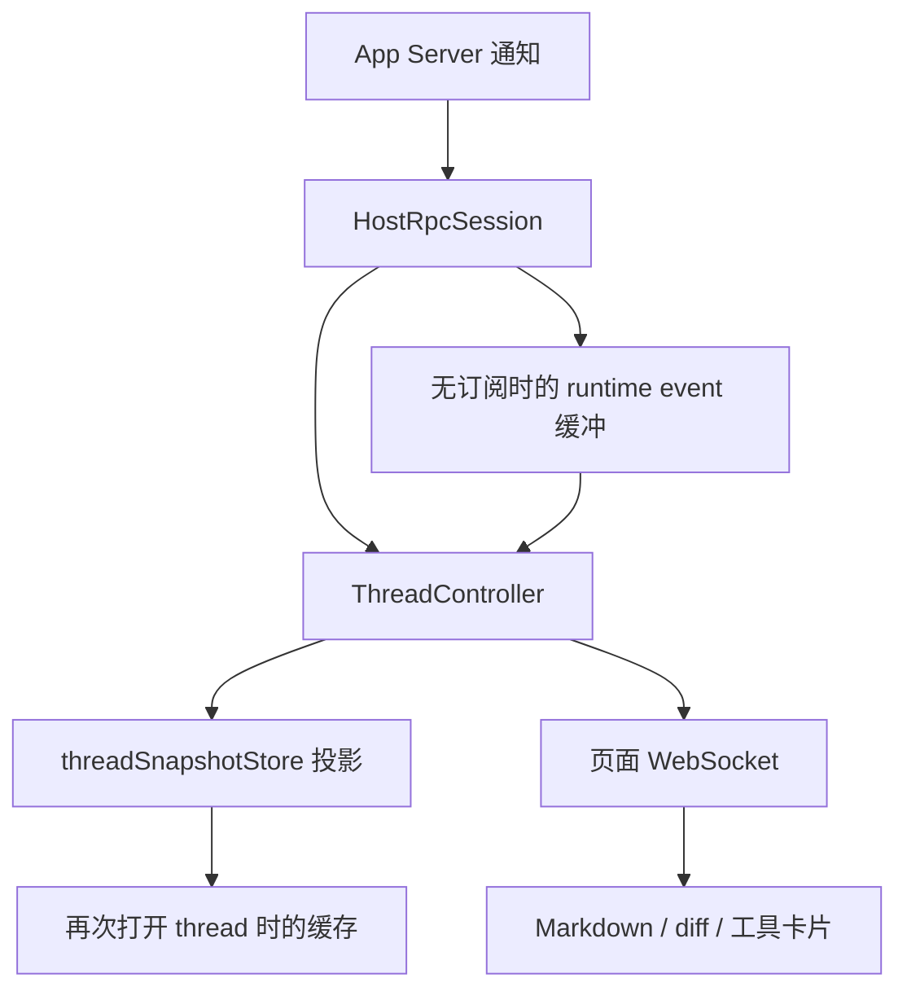

# 托管 Runtime 架构：从用户 Docker 到 App Server

本文描述 **当前代码** 里，一个 Gateway 用户如何拉起自己的 Docker Agent、API Key 如何进入模型请求、skills / MCP / 工具权限如何生效，以及 Gateway 与 `codex app-server` 之间如何往返和管上下文。

对照实现以仓库现状为准，不是规划稿。两条运行时并存：

| 路径        | 用户看到的主机                              | App Server 在哪                            | 本文重点     |
| ----------- | ------------------------------------------- | ------------------------------------------ | ------------ |
| 托管 Docker | 侧栏 **Local**（保留 Host ID `2000000000`） | Gateway 机器上的每用户容器                 | 是           |
| SSH 主机    | 用户配置的远端机                            | 远端 `$CODEX_HOME` 上的 `codex app-server` | 对照写出差异 |

浏览器 **从不** 直连 App Server，也不持有 SSH / Codex / 上游 API Key。

## 1. 总览



要点：

- **一个 Gateway 用户 ↔ 一个长期 Docker 容器**。该用户的多个 thread 复用同一容器、同一 App Server。
- 容器内跑的是官方 CLI 的子命令 `codex app-server`，不是再套一层 TUI。
- 上游 Key 只存在 Gateway SQLite（`CODEX_GATEWAY_CONFIG_SECRET` 加密）。容器拿到的是短期 **runtime token**，每次推理仍回 Gateway 代理。

## 2. 用户如何启动自己的 Docker

侧栏里的 Local 不是 SSH。点到 Local / 打开 thread 时，Gateway 会确保该用户的 runtime 是 `ready`。

设置页也可以显式调用 `POST /api/runtime/start`。选 Local 主机时 `requireWorkspaceHost()` 会先 `start(userId)` 再解析连接。



实现落点：

- `server/api/runtime/start.post.ts`：当前登录用户启动自己的 runtime。
- `server/utils/gateway/runtime-manager/runtime-service.ts`：`provision` → `start` → `finishCompatibility()`。
- `packages/agent-runtime-manager/src/lifecycle-service.ts`：容器名 `codex-runtime-<userHash16>-<runtimeHash12>`。
- 两个持久卷：
  - `codex-home-<…>` → `/codex-home`（`CODEX_HOME`）
  - `workspace-<…>` → `/workspace`（Local 项目路径常量 `MANAGED_WORKSPACE_PATH`）
- 容器用户 `10001:10001`，只读根文件系统，`CapDrop=ALL`，`no-new-privileges`，`/tmp` tmpfs，端口 `4500` 只挂在内部网络 `agent-runtime`。

Gateway 对外把这台机器合成一个 Host：

- `id = 2000000000`，`connectionKind = "managed"`，名称 **Local**
- 项目 `workspace`，`remotePath = /workspace`

`resolveManagedHost()` 用 Runtime Manager 的 inspect 结果构造内存中的 `HostRecord`（含 WebSocket URL 和 **服务令牌**）。这个 Host **不进** 用户的 SSH 主机表。

## 3. API Key 如何传入

当前产品规则：**Provider 和上游 Key 只由管理员配置；普通用户不能自带 Key。**  
托管容器也不读宿主机 `~/.codex/auth.json`。

### 3.1 管理员写入

管理员 HTTP：

1. `POST /api/admin/providers`：`baseUrl`、`wireApi`、`apiKey`（加密进 `model_providers`）
2. `POST /api/admin/providers/:id/models`：模型与 capabilities
3. `POST /api/admin/providers/:id/grants`：把某个模型授权给 `userId`

浏览器列表接口 **不含** `apiKey`。

### 3.2 启动容器时注入什么

`providerConfigForUser()` 取该用户 **第一条** 已授权模型，发给 Runtime Manager 的不是上游 Key，而是：

| 字段                     | 含义                                                                                                                           |
| ------------------------ | ------------------------------------------------------------------------------------------------------------------------------ |
| `providerId` / `modelId` | 授权范围                                                                                                                       |
| `baseUrl`                | `RUNTIME_PROVIDER_PROXY_BASE_URL` + `/{providerId}/v1`，生产 compose 默认为 `http://codex-gateway:3000/api/internal/providers` |
| `wireApi`                | 对 App Server 固定为 `responses`                                                                                               |
| `token`                  | HMAC runtime token（`rt1.`…），TTL 30 天，绑定 userId / runtimeId / provider / model                                           |

Docker 环境变量：

- `CODEX_GATEWAY_PROVIDER_*`（含 token）
- `CODEX_REMOTE_TOKEN`：App Server WebSocket 握手用，entrypoint **立刻 unset**，只把 SHA-256 传给 `--ws-token-sha256`

entrypoint 把 `/codex-home/config.toml` **整文件写成**：

```toml
model_provider = "codex_gateway"
[model_providers.codex_gateway]
name = "Codex Gateway"
base_url = "<proxy>"
env_key = "CODEX_GATEWAY_PROVIDER_TOKEN"
wire_api = "responses"
```

Token 留在环境变量，**不写进 toml、不进 argv**。

生产 compose 显式把 `RUNTIME_PROVIDER_PROXY_BASE_URL` 设为 `http://codex-gateway:3000/api/internal/providers`。`runtime-manager` 和 `agent-runtime` 也使用可配置的 `/24` 网段；部署时必须避开模型服务、VPN 和公司内网路由，默认分别为 `10.254.250.0/24` 与 `10.254.251.0/24`。

### 3.3 推理时 Key 在哪出现



容器和浏览器全程看不到上游 Key。每次请求都会再查 grant；撤权后即使旧 token 未过期也会 403。

SSH 主机 **不走** 这套代理：Key 在远端 `~/.codex/auth.json` / `config.toml`。

## 4. Skills 和 MCP tools 如何生效

Gateway **没有** 把 skills / MCP 清单作为启动参数传进容器。生效的是 App Server 在自己的 `$CODEX_HOME` 和 thread `cwd` 上发现的内容。



分工：

| 文件 / 目录                      | 作用                                                                      |
| -------------------------------- | ------------------------------------------------------------------------- |
| `auth.json`                      | 仅 Codex 登录（ChatGPT / API Key）。**不是** MCP 列表，也不是 skills 正文 |
| `config.toml`                    | `[mcp_servers.*]`、模型、sandbox、feature；可禁用部分 skills              |
| `$CODEX_HOME/skills/**/SKILL.md` | 用户 / 系统 skills                                                        |
| 项目 `cwd`                       | 仓库内 skills                                                             |
| `.credentials.json`              | MCP OAuth（file store）                                                   |

Gateway 对 MCP 只做 **观测和中继**：

- `mcpServerStatus/list` → 前端状态条
- `mcpServer/event/stream/*` → 事件流
- 审批 / elicitation 走通用 `serverRequest`

### 当前托管容器的实际效果

entrypoint 在存在 Gateway provider 时 **覆盖整份** `config.toml`，因此：

- 卷里若曾有 `[mcp_servers]`，启动会被冲掉
- 空卷没有用户 `skills/`，只剩 Codex 包内置 skills
- `/workspace` 里如果以后有项目 skills，会随 thread `cwd=/workspace` 被发现

SSH 主机相反：远端用户家目录的 `~/.codex` 和项目目录就是事实源；Gateway 最多给 `config.toml` 补 `[features].apply_patch_streaming_events`。

## 5. Tools 的运行权限

托管路径是 **两层隔离**：Docker 先把进程关进容器，再告诉 App Server 不要用内层 bubblewrap。



原因在 `thread-payload.ts`：托管容器已经隔离，内层 Seatbelt/bubblewrap 起不来，所以跳过。SSH 主机默认仍是 `workspace-write` + 按次审批，**不会** 塞 `sandboxPolicy`。

工具实际在哪执行：

- **shell / apply_patch / 文件**：Agent 容器内，工作区 `/workspace`
- **MCP tools**：App Server 按 `config.toml` spawn 或连 HTTP MCP；进程也在该容器里（当前托管默认几乎没有用户 MCP）
- **模型调用**：出容器，经 Gateway 代理到上游

浏览器不能执行任意 RPC，也不能把工具结果伪造成 App Server 时间线。

## 6. 和 App Server / Codex CLI 怎么沟通

容器里的二进制就是 `@openai/codex`，子命令 `app-server`。没有再启动 `codex` TUI。

同一套 `ThreadBroker` / `CodexRpcClient` 服务两种传输：

|            | 托管 Docker                                                                                               | SSH                                                   |
| ---------- | --------------------------------------------------------------------------------------------------------- | ----------------------------------------------------- |
| 传输       | `ManagedCodexRpcTransport`：容器 `ws://<ip>:4500` + Bearer **服务令牌**                                   | SSH channel 上 `codex app-server proxy` → Unix socket |
| 版本       | 镜像钉死 npm latest；`skipVersionCheck`                                                                   | Gateway 负责探测、升级远端 CLI 再连                   |
| initialize | `clientInfo` 冒充 `codex-tui` + 当前 `SUPPORTED_CODEX_VERSION`；`experimentalApi`；MCP 扩展 `openai/form` | 相同 JSON-RPC                                         |



常见 RPC（Gateway 实际会发的子集）：

- 会话：`initialize` / `initialized`
- 线程：`thread/start`（`historyMode=paginated`，`experimentalRawEvents=true`）、`thread/read`、`thread/resume`、`thread/list`、归档删除重命名
- 回合：`turn/start`、`turn/interrupt`、steer
- 历史：`thread/turns/list`、`thread/items/list`
- MCP：`mcpServerStatus/list`、event stream
- 文件：`fs/watch` 等
- 上行：`serverRequest`（审批、elicitation、表单）；Gateway 本地回答 `currentTime/read`

`thread/start` **不** 携带 MCP/skills 列表，只带 sandbox、cwd、historyMode 等。

## 7. 返回路径

事实源是 App Server 事件，不是 Gateway 自造的第二条时间线。



- 流式输出、工具进度、MCP 状态、`turn/completed` 都是通知。
- 需要人决策时，App Server 发 **JSON-RPC request**；前端 `serverRequest.respond` 把 result/error 送回。
- 多 tab：同一 host 共用 Gateway 侧一条 RPC，WS 再扇出。
- 刷新：URL / 轻量路由恢复 → `thread/read` + 分页 turns；有健康 snapshot 则不整段重放 JSONL。

## 8. 上下文管理

| 层           | 谁负责                           | 行为                                                                        |
| ------------ | -------------------------------- | --------------------------------------------------------------------------- |
| 模型上下文   | App Server / Codex core          | 按官方规则增量组装；自动 compact 由 Codex `model_auto_compact_*` 等配置触发 |
| 持久历史     | App Server thread store          | 托管路径强制 `historyMode=paginated`                                        |
| Gateway 缓存 | `threadSnapshotStore` + 事件投影 | 可失效；打开过浅或断线才向 App Server 再拉                                  |
| 浏览器       | 当前页 WS + 打开时的 snapshot    | 不保存完整时间线                                                            |

分页约定：

- 先 `thread/read`（元数据，可不带全量 turns）
- `thread/turns/list` 拉 Turn 摘要页
- 展开某一 turn 再 `thread/items/list`
- legacy JSONL 没有稳定 item 分页，Gateway 不会对它走 item API

Compact：App Server 自己跑；Gateway 根据事件显示「正在压缩上下文」，**不** 在 Gateway 里改写历史。官方约束（无历史重写、注入片段有界）仍由 App Server 保证。

托管容器里 `/codex-home` 卷会留下该用户的 session / thread 文件，重启容器可 resume。这不是 Gateway SQLite 里的第二份对话库。

## 9. 和「用户自己的 ~/.codex」的关系

| 做法                                                 | 当前是否支持                                 |
| ---------------------------------------------------- | -------------------------------------------- |
| 管理员统一 Key + 托管容器                            | 支持                                         |
| SSH + 每台物理机一个系统用户 + 各自 `~/.codex`       | 支持                                         |
| 启动托管容器时 bind 用户 `auth.json` / `config.toml` | **不支持**                                   |
| 用户没交配置走系统 Key，交了再 merge 进容器          | **未实现**；且与「覆盖整份 config.toml」冲突 |

若以后做 merge：有用户自己的 Key 时不要再写 `model_provider = "codex_gateway"`；只叠模型/沙箱时保留代理；`auth.json` 宜整份替换；MCP OAuth 还要带 `.credentials.json`；skills 还要带目录，不是两份 toml/json 就够。

## 10. 关键代码索引

| 环节            | 路径                                                                                           |
| --------------- | ---------------------------------------------------------------------------------------------- |
| 启动 runtime    | `server/api/runtime/start.post.ts`，`runtime-service.ts`                                       |
| Local Host 合成 | `server/utils/gateway/runtime-manager/local-workspace.ts`                                      |
| 建容器 / 隔离   | `packages/agent-runtime-manager/src/lifecycle-service.ts`，`docker-engine.ts`                  |
| 入口与 config   | `docker/agent-runtime-entrypoint.sh`                                                           |
| Key 与代理      | `providers/provider-store.ts`，`runtime-token.ts`，`provider-proxy.ts`                         |
| RPC             | `infra/rpc/rpc.ts`，`managed-rpc-transport.ts`，`runtime/host-rpc-session.ts`                  |
| 线程 / 历史     | `runtime/broker.ts`，`thread-payload.ts`，`thread-open-service.ts`，`thread-history-reader.ts` |
| MCP 观测        | `runtime/mcp-runtime.ts`                                                                       |
| 沙箱差异        | `protocol/thread-payload.ts`                                                                   |
